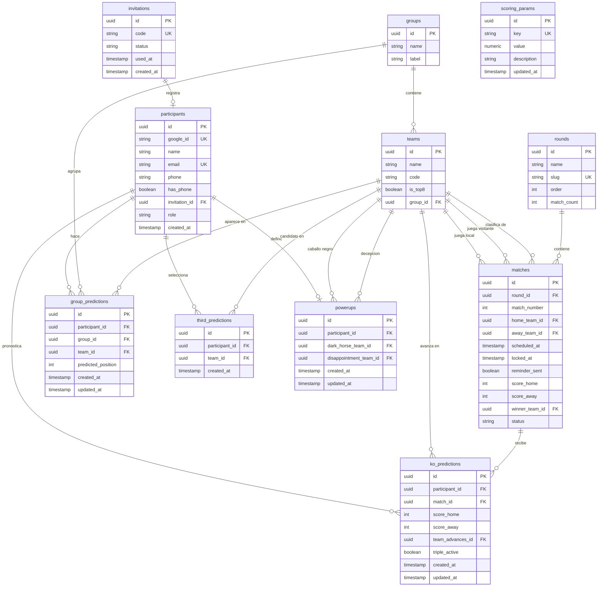

```mermaid
erDiagram
  participants {
    uuid id PK
    string google_id UK
    string name
    string email UK
    string phone
    boolean has_phone
    uuid invitation_id FK
    string role
    timestamp created_at
  }

  invitations {
    uuid id PK
    string code UK
    string status
    timestamp used_at
    timestamp created_at
  }

  groups {
    uuid id PK
    string name
    string label
  }

  teams {
    uuid id PK
    string name
    string code
    boolean is_top8
    uuid group_id FK
  }

  rounds {
    uuid id PK
    string name
    string slug UK
    int order
    int match_count
  }

  matches {
    uuid id PK
    uuid round_id FK
    int match_number
    uuid home_team_id FK
    uuid away_team_id FK
    timestamp scheduled_at
    timestamp locked_at
    boolean reminder_sent
    int score_home
    int score_away
    uuid winner_team_id FK
    string status
  }

  group_predictions {
    uuid id PK
    uuid participant_id FK
    uuid group_id FK
    uuid team_id FK
    int predicted_position
    timestamp created_at
    timestamp updated_at
  }

  third_predictions {
    uuid id PK
    uuid participant_id FK
    uuid team_id FK
    timestamp created_at
  }

  powerups {
    uuid id PK
    uuid participant_id FK
    uuid dark_horse_team_id FK
    uuid disappointment_team_id FK
    timestamp created_at
    timestamp updated_at
  }

  ko_predictions {
    uuid id PK
    uuid participant_id FK
    uuid match_id FK
    int score_home
    int score_away
    uuid team_advances_id FK
    boolean triple_active
    timestamp created_at
    timestamp updated_at
  }

  scoring_params {
    uuid id PK
    string key UK
    numeric value
    string description
    timestamp updated_at
  }

  invitations ||--o| participants : "registra"

  participants ||--o{ group_predictions : "hace"
  participants ||--o{ third_predictions : "selecciona"
  participants ||--o| powerups : "define"
  participants ||--o{ ko_predictions : "pronostica"

  groups ||--o{ teams : "contiene"
  groups ||--o{ group_predictions : "agrupa"

  teams ||--o{ group_predictions : "aparece en"
  teams ||--o{ third_predictions : "candidato en"
  teams ||--o{ matches : "juega local"
  teams ||--o{ matches : "juega visitante"
  teams ||--o{ matches : "clasifica de"
  teams ||--o{ ko_predictions : "avanza en"
  teams ||--o{ powerups : "caballo negro"
  teams ||--o{ powerups : "decepcion"

  rounds ||--o{ matches : "contiene"
  matches ||--o{ ko_predictions : "recibe"
```

